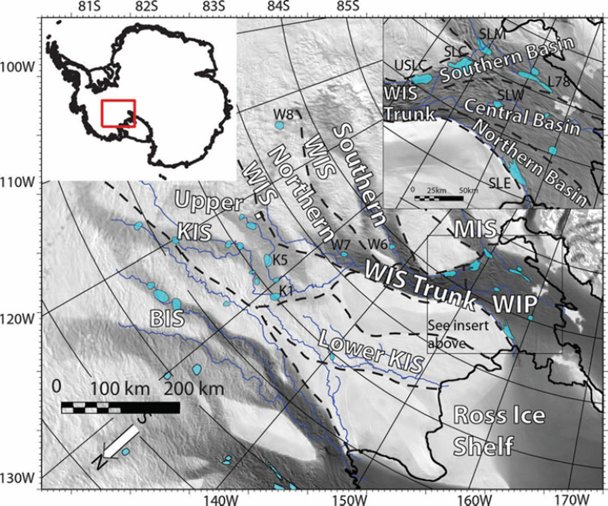

# SP2026-FP01-Ice-Sheet-Velocity
Exploring the ice sheet velocity change of Whillans Ice Plain, West Antarctica between 2008 and 2019.

## Project Title:  Ice Sheet Velocity Change at Whillans Ice Plain
## Name(s) & Handles: 
- Kaitlyn Sanchez - K-Sanchez126
- Emilia Orta - emiliaorta
- Kadidia Mariko -  kamam203

## Short Summary: 
- This project will explore how the velocity of the Whillans Ice Plain in West Antarctica changed between 2008 and 2019, as well as how it changed spatially using GPS and GNSS data. The primary output will be figures showing the spatial and temporal patterns of velocity, as well as any correlations between velocity change and tidal forcings and between velocity change and the timing of stick-slip events.

## Introduction:

Figure demonstrating location of Whillans Ice Plain [1]. 
 
- Where:
  - Whillans Ice Plain (WIP) is the lower part of the Mercer and Whillans ice stream in West Antarctica. It drains from the interior ice of the West Antarctic Ice Sheet onto the Ross Ice Shelf[1].
- Why do we care about this ice stream: 
  - Ice changes in Antarctica are usually due to activity in the ice streams, and understanding the conditions that lead to different ice stream acceleration changes helps to determine how sea level may change in the future. Both deceleration and stick-slip motion of the ice stream could cause it to stagnate (as seen in nearby streams like Kamb). Significant changes in Whillans ice stream speak to the stabilization of the West Antarctica ice sheet and how sea level rise will be affected going forward [3-7].

- Evidence for possible correlations between velocity and tidal forcings and stick-slip event timings:
  -  Rather than being governed by continuous flow, one of the drivers of the motion is stick-slip events. These events cause the ice sheet to move forward by about 0.2-0.6 m in about 30-60 minutes, either once or twice a day, depending on the tidal features. Namely, in order to have a secondary slip in a day, there must be a low-moderate tide height and a semi-diurnal tidal cycle [3].
- Current paaterns we are seeing:
  - Examination of the long-term velocity time series shows that the deceleration is not occurring at a steady rate but varies on smaller time scales. Additionally, based on point location measurements, the velocity deceleration is non-uniform across the ice sheet as well as through time [2].
- Why we care about the spatial and temporal resolution over time: 
  - The spatial and temporal resolution over time determines how ice is moving in the interior of the ice stream and at the margins. Having constraints of this motion beyond just the point measurements we currently have allows us to better estimate how the Whillans ice stream motion will behave in the future, which is a factor involved in sea-level rise and how climate change impacts the cryosphere [1].

- Expected result: 
  - Based on current GPs records and a catalog of stick-slip events, it is expected to find that Whillians deceleration varies through time (such as on interannual timescales) and that this variability also varies spatially. There are currently GNSS-derived average velocities that show the velocity is correlated with tidal forces. The derived velocities from ITS_LIVE should also show these tidal forcing, and time heterogeneities and also show the spatial variability which is not currently clear. [3-6].

- How does it answer a useful question:
  - Using GPS/GNSS data to look at the velocity changes over time provides greater insight as to how the velocity change has varied spatially. Additionally, this project aims to make connections between velocity changes, tidal forcings, and the timing of stick-slip events. 

## Problem Statement, questions and/or objectives: 
- Statement:
  - Although GPS studies have shown at specific locations that ice sheet velocity at Whillans Ice Stream has slowed, how that deceleration has changed over the full ice sheet, how the velocity fluctuates across different time scales, and if there is a correlation between the velocity change and stick-slip events and tidal forcings, is still not well documented.

-  Questions:
  - Are there detectable relationships between ice surface velocity, timing of stick-slip events, and tidal forcings?
  - How has the temporal variability of ice surface velocity changed between 2008 and 2019, and how does it vary on seasonal/decadal timescales?
  - What are the spatial patterns of ice surface velocity/how does the magnitude of velocity slowing vary between different features of the ice sheet (such as the grounding zone, the middle of the ice sheet, and the margins). 
 
-  Objectives:
  - Compute and clean velocity from PPP files derived from GNSS data at various GPS locations across Whillans Ice Plain to produce figures that show how velocity has changed over time and space.
  - Identify correlations between velocity, tidal forcings, and stick-slip timings.

## Datasets:
- Whillans Ice Plain GNSS RINEX, Kinematic Positions, and Stick-Slip Event Catalog 

## Tools/Packages: 
- Itslive-py
- Xarray
- Pyproj 
- Scipy 
- Pandas 
- Numpy
- Matplotlib 
- Cartopy

## Planned Methodology
- Based on the GPS station locations used for the tidal features present in (Katz et al., 2026) determine the spatial region that will be used for looking at the velocities. Then, use the precise point positioning files to compute the velocity. 
- Get the PPP file into a cleaned data frame of GPS epochs using the backward and forward passes as position estimates to construct the decimal lat and long from the degree-minute-seconds column, and apply a filter based on the position RMS to limit noise 
- Project the coordinates from lat, lon to Antarctic polar stereographic coordinates 
- Create daily background/time series velocity 
- Loop over every station and then concatenate it into one file 
- Use the daily velocity estimates in a 30-day window to compute a median value for each station for each of the icequakes 
- Create figures that tell the story of this data 
  - Looking at outliers of the position (to justify smoothing with the median versus the mean)
  - Creating a time series of the background velocity with spatial coordinates/cartopy in the background  
  - Show different smoothing techniques to clean the background velocity data 
  - Plot of velocity time series (one for each station)
  - Plot how the change in velocity corresponds to the stick-slip events 

## Expected outcomes:
- Expected observations:
  - The velocity is decreasing over time and is non-uniform across the ice plain. 
  - The velocity acceleration changes are correlated with timing of stick-slip events and tidal forcings.   
- Figure 1: Visualization of outliers/noise in the position value at each 15-second interval 
- Figure 2: Colormesh showing velocity change compared to spatial coordinates across the area of interest between 2008-2019
- Figure 3: Multi-panel comparison of how different smoothing techniques affect the background velocity data 
- Figure 4: Plot of velocity time series (one line for each station) 
- Figure 5: Plot that shows how the changes in velocity are correlated with the timing of stick-slip events on a decadal timescale

## Anticipated Challenges: 
- We were originally going to use ITS_LIVE velocity data derived from Sentinel-1. However, there was a gap in coverage for this region of Antarctica during the 2008-2019 time range. Therefore, we had to pivot to backing out the velocity from the PPP files based on GNSS data instead.

## References:
[1]
S. P. Carter, H. A. Fricker, and M. R. Siegfried, “Evidence of rapid subglacial water piracy under Whillans Ice Stream, West Antarctica,” Journal of Glaciology, vol. 59, no. 218, pp. 1147–1162, 2013, doi: https://doi.org/10.3189/2013jog13j085.
[2]
R. Bindschadler, P. Vornberger, and L. Gray, “Changes in the ice plain of Whillans Ice Stream, West Antarctica,” Journal of Glaciology, vol. 51, no. 175, pp. 620–636, 2005, doi: https://doi.org/10.3189/172756505781829070.
[3]
J. P. Winberry, S. Anandakrishnan, R. B. Alley, D. A. Wiens, and M. J. Pratt, “Tidal pacing, skipped slips and the slowdown of Whillans Ice Stream, Antarctica,” Journal of Glaciology, vol. 60, no. 222, pp. 795–807, 2014, doi: https://doi.org/10.3189/2014jog14j038.
[4]
A. S. Gardner et al., “ITS_LIVE global glacier velocity data in near-real time,” The cryosphere, vol. 19, no. 9, pp. 3517–3533, Sep. 2025, doi: https://doi.org/10.5194/tc-19-3517-2025.
[5]
Z. S. Katz, M. R. Siegfried, and L. Padman, “Slip‐Event Timing and Ice Velocity Vary at Long‐Period Ocean Tidal Frequencies at Whillans Ice Plain, West Antarctica,” Journal of Geophysical Research: Earth Surface, vol. 131, no. 1, Jan. 2026, doi: https://doi.org/10.1029/2025jf008770.
[6]
B. P. Lipovsky and E. M. Dunham, “Slow‐slip events on the Whillans Ice Plain, Antarctica, described using rate‐and‐state friction as an ice stream sliding law,” Journal of Geophysical Research Earth Surface, vol. 122, no. 4, pp. 973–1003, Apr. 2017, doi: https://doi.org/10.1002/2016jf004183.
[7]
M. Dirscherl, A. J. Dietz, S. Dech, and C. Kuenzer, “Remote sensing of ice motion in Antarctica – A review,” Remote Sensing of Environment, vol. 237, p. 111595, Feb. 2020, doi: https://doi.org/10.1016/j.rse.2019.111595.
[8]
G. Guerin, Aurélien Mordret, D. Rivet, B. P. Lipovsky, and B. M. Minchew, “Frictional Origin of Slip Events of the Whillans Ice Stream, Antarctica,” Geophysical Research Letters, vol. 48, no. 11, Jun. 2021, doi: https://doi.org/10.1029/2021gl092950.

 
